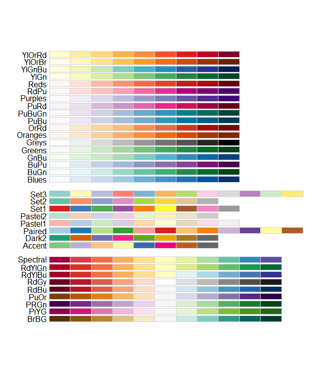

Color Palettes
================

-   <a href="#online-tools-for-creating-color-palettes"
    id="toc-online-tools-for-creating-color-palettes">Online Tools for
    creating color palettes</a>
-   <a href="#color-palettes-in-base-r"
    id="toc-color-palettes-in-base-r">Color palettes in Base-R</a>
-   <a href="#extension-package" id="toc-extension-package">Extension
    package</a>

This is compilation of many resources about color-palettes for data viz
in R.

### Online Tools for creating color palettes

-   [ColorBrewer Palettes](https://colorbrewer2.org/)

### Color palettes in Base-R

``` r
RColorBrewer::display.brewer.all()
```

<!-- -->

### Extension package

Just Install the package
[`{paletteer}`](https://github.com/EmilHvitfeldt/paletteer). It will get
you all covered. Also [check this this comprehensive list made by Emil
Hvitfeldt (author of
`{paletteer}`)](R/compre_list_palettes_from_Emil.md).
