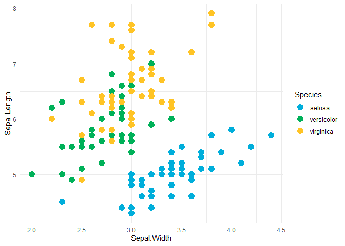
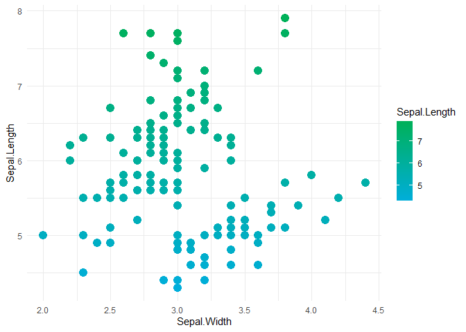
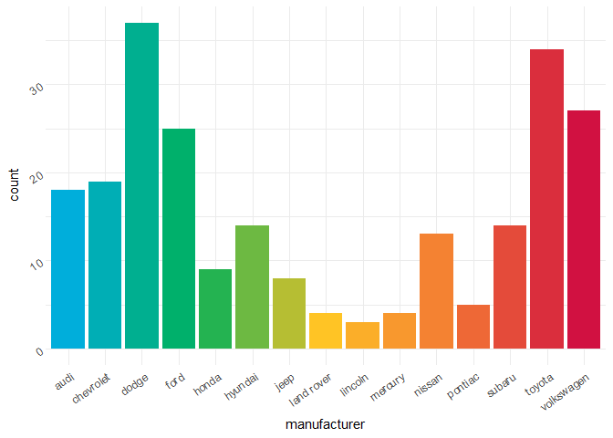

Custom Color Palettes
================

-   <a href="#creating-corporate-color-palettes-for-ggplot2"
    id="toc-creating-corporate-color-palettes-for-ggplot2">Creating
    Corporate Color Palettes for ggplot2</a>

> **DISCLAIMER:** This is actually a copy pasted document from these
> sources. \[1\] [Creating Corporate Color Palettes for
> GGPlot2](https://drsimonj.svbtle.com/creating-corporate-colour-palettes-for-ggplot2)

## Creating Corporate Color Palettes for ggplot2

Basic steps are:

-   creating a Named vector of hex codes for the colors
-   creating a function to access the color codes
-   creating named list of color palettes
-   creating function to access the color palettes
-   creating ggplot2 compatible scale function to use the palettes

``` r
library(ggplot2)

theme_set(theme_minimal())
```

#### creating the named vector

``` r
# drsimonj corporate colors

drsimonj_colors <- c(
  `red`        = "#d11141",
  `green`      = "#00b159",
  `blue`       = "#00aedb",
  `orange`     = "#f37735",
  `yellow`     = "#ffc425",
  `light_grey` = "#cccccc",
  `dark_grey`  = "#8c8c8c")
```

#### the accessor funciton

``` r
drsimonj_cols <- function(...) {
  cols <- c(...)
  
  if (is.null(cols)) {
    return(drsimonj_colors)
  }
  
  drsimonj_colors[cols]
}
```

``` r
drsimonj_cols()
```

    ##        red      green       blue     orange     yellow light_grey  dark_grey 
    ##  "#d11141"  "#00b159"  "#00aedb"  "#f37735"  "#ffc425"  "#cccccc"  "#8c8c8c"

``` r
drsimonj_cols("blue", "red")
```

    ##      blue       red 
    ## "#00aedb" "#d11141"

#### combining color into palettes

``` r
drsimonj_palettes <- list(
  main = drsimonj_cols("blue", "green", "yellow"),
  cool = drsimonj_cols("blue", "green"),
  hot = drsimonj_cols("yellow", "orange", "red"),
  mixed = drsimonj_cols("blue", "green", "yellow", "orange", "red"),
  grey = drsimonj_cols("light_grey", "dark_grey")
)
```

#### creating palettes accessor and creator function

``` r
drsimonj_pal <- function(palette = "main", reverse = FALSE, ...) {
  pal <- drsimonj_palettes[[palette]]
  
  if (reverse) pal <- rev(pal)
  
  colorRampPalette(pal, ...)
}
```

`colorRamPalette` will return another function that will enable us
create shades between our original colors.

``` r
drsimonj_pal("cool")
```

    ## function (n) 
    ## {
    ##     x <- ramp(seq.int(0, 1, length.out = n))
    ##     if (ncol(x) == 4L) 
    ##         rgb(x[, 1L], x[, 2L], x[, 3L], x[, 4L], maxColorValue = 255)
    ##     else rgb(x[, 1L], x[, 2L], x[, 3L], maxColorValue = 255)
    ## }
    ## <bytecode: 0x000001dc7e67c908>
    ## <environment: 0x000001dc7e68d718>

``` r
drsimonj_pal("cool")(2)
```

    ## [1] "#00AEDB" "#00B159"

``` r
drsimonj_pal("cool")(10)
```

    ##  [1] "#00AEDB" "#00AECC" "#00AEBE" "#00AFAF" "#00AFA1" "#00AF92" "#00B084"
    ##  [8] "#00B075" "#00B067" "#00B159"

#### scales for ggplot2

``` r
# color scale
scale_color_drsimonj <- function(palette = "main", discrete = TRUE, reverse = FALSE, ...) {
  pal <- drsimonj_pal(palette = palette, reverse = reverse)
  
  if (discrete) {
    ggplot2::discrete_scale(
      aesthetics = "colour", 
      scale_name = paste0("drsimonj_", palette), 
      palette = pal,
      ...
    ) 
  } else {
    scale_colour_gradientn(colours = pal(256), ...)
  }
}

# fill scale
scale_fill_drsimonj <- function(palette = "main", discrete = TRUE, reverse = FALSE, ...) {
  pal <- drsimonj_pal(palette = palette, reverse = reverse)
  
  if (discrete) {
    ggplot2::discrete_scale(
      aesthetics = "fill",
      scale_name = paste0("disimonj_", palette),
      palette = pal,
      ...
    ) 
  } else {
      scale_fill_gradientn(colours = pal(256), ...)
  }
}
```

#### testing these palettes

``` r
ggplot(iris, aes(Sepal.Width, Sepal.Length, color = Species)) +
  geom_point(size = 4) + 
  scale_color_drsimonj()
```

<!-- -->

``` r
ggplot(iris, aes(Sepal.Width, Sepal.Length, color = Sepal.Length)) +
  geom_point(size = 4) + 
  scale_color_drsimonj(discrete = FALSE, palette = "cool")
```

<!-- -->

``` r
ggplot(mpg, aes(manufacturer, fill = manufacturer)) +
  geom_bar() +
  theme(
    axis.text = element_text(angle = 35, hjust = 1)
  ) +
  scale_fill_drsimonj(palette = "mixed", guide = "none")
```

<!-- -->
