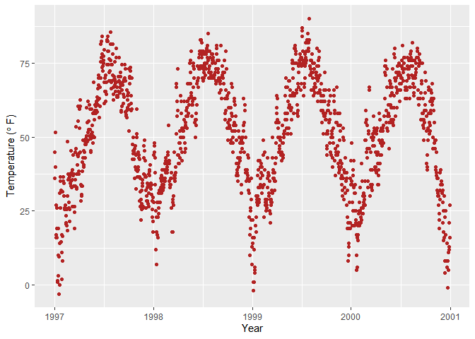

Ggplot2
================

## Working with Axes, Titles, Legends and theming etc.

``` r
library(ggplot2)

chic <- readr::read_csv("https://raw.githubusercontent.com/z3tt/ggplot-courses/main/data/chicago-nmmaps-custom.csv")
```

    ## Rows: 1461 Columns: 11
    ## ── Column specification ────────────────────────────────────────────────────────
    ## Delimiter: ","
    ## chr  (3): city, season, month
    ## dbl  (7): temp, o3, dewpoint, pm10, yday, month_numeric, year
    ## date (1): date
    ## 
    ## ℹ Use `spec()` to retrieve the full column specification for this data.
    ## ℹ Specify the column types or set `show_col_types = FALSE` to quiet this message.

``` r
g <- ggplot(chic, aes(date, temp))

g + geom_point(color = "firebrick") +
  labs(x = "Year", y = expression( paste("Temperature (", degree ~ F, ")")))
```

<!-- -->

#### Interesting findings

`paste0` is not working inside the `expression`. But `paste` works and
we have to give extra space inside the `paste` to separate the words.
This happens both for `ggplot2` and `base-plot`. Asked a question about
this behaviour in
[SO](https://stackoverflow.com/questions/73045568/why-paste0-is-not-working-properly-inside-expression-in-either-ggplot2-or-ba)

##### for ggplot2

``` r
library(ggplot2)

ggplot(mtcars, aes(mpg, disp)) +
  geom_point() +
  labs(
    x = expression(paste0("It's","mpg")^("paste0 is not working")),
    y = expression(paste("It's ", "disp")^("paste is working")),
  )
```

<!-- -->

##### for base-plot

``` r
plot(mtcars$disp ~ mtcars$mpg, 
     xlab = expression(paste0("mpg")^("paste0 is not working")),
     ylab = expression(paste("disp")^("paste is working"))
     )
```

<!-- -->
