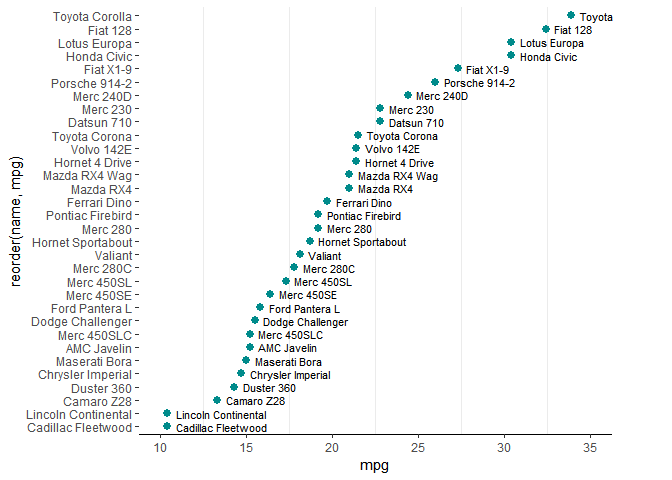
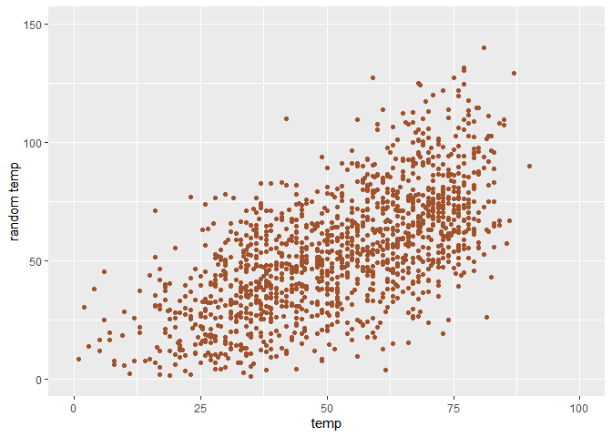
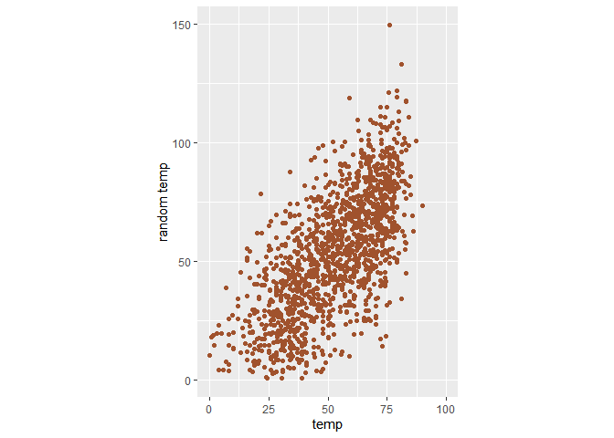
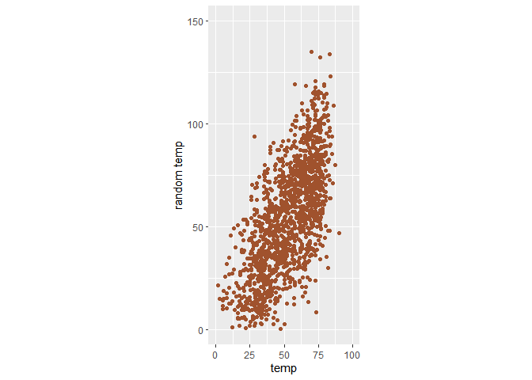
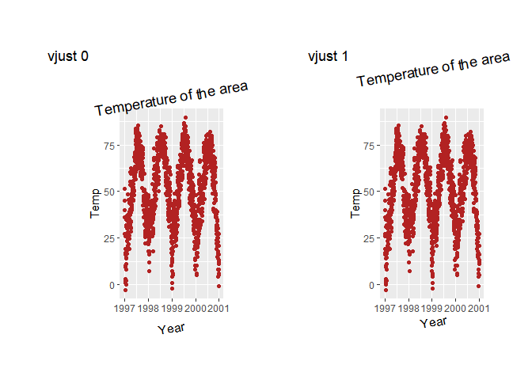
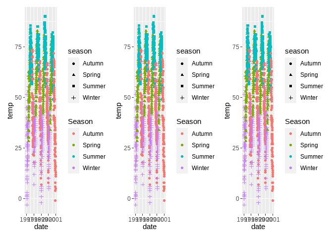
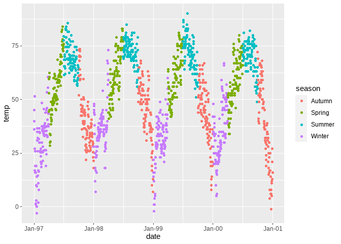
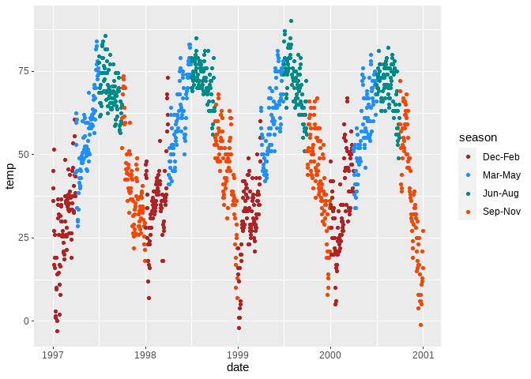
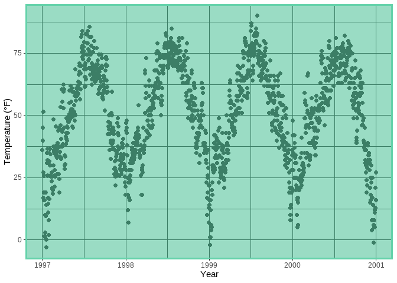

ggplot2 Notes
================

-   <a href="#setup" id="toc-setup">Setup</a>
-   <a href="#working-with-axes-titles-legends-and-themeing-etc"
    id="toc-working-with-axes-titles-legends-and-themeing-etc">Working with
    Axes, Titles, Legends and themeing etc.</a>
    -   <a href="#paste-or-paste0-doesnt-work-as-intended-inside-the-expression"
        id="toc-paste-or-paste0-doesnt-work-as-intended-inside-the-expression"><code>paste</code>
        or <code>paste0</code> doesn’t work as intended inside the
        <code>expression()</code></a>
-   <a href="#vjust-moves-text-vertically-from-the-perspective-of-the-axes"
    id="toc-vjust-moves-text-vertically-from-the-perspective-of-the-axes"><code>vjust</code>
    moves text vertically from the perspective of the Axes</a>
-   <a href="#changes-in-margint-r-b-l-are-from-our-perspective"
    id="toc-changes-in-margint-r-b-l-are-from-our-perspective">Changes in
    <code>margin(t, r, b, l)</code> are from our perspective.</a>
-   <a href="#coord_cartesianylim--c0-50and-ylimc0-50-are-not-the-same"
    id="toc-coord_cartesianylim--c0-50and-ylimc0-50-are-not-the-same"><code>coord_cartesian(ylim = c(0, 50))</code>and
    <code>ylim(c(0, 50))</code> are not the same</a>
-   <a href="#forcing-a-plot-to-start-at-origin"
    id="toc-forcing-a-plot-to-start-at-origin">Forcing a plot to start at
    origin</a>
-   <a href="#coordinates-with-ratio"
    id="toc-coordinates-with-ratio">Coordinates with <code>ratio</code></a>
-   <a href="#using-function-to-alter-labels"
    id="toc-using-function-to-alter-labels">Using function to alter
    labels</a>
-   <a href="#reminder-about-vjust-and-hjust"
    id="toc-reminder-about-vjust-and-hjust">Reminder about
    <code>vjust</code> and <code>hjust</code></a>
-   <a href="#fonts-with-r" id="toc-fonts-with-r">Fonts with R</a>
    -   <a href="#working-with-showtext" id="toc-working-with-showtext">working
        with <code>showtext</code></a>
-   <a href="#working-with-legends" id="toc-working-with-legends">Working
    with legends</a>
    -   <a href="#removing-legends" id="toc-removing-legends">Removing
        legends</a>
    -   <a href="#removing-legend-titles"
        id="toc-removing-legend-titles">Removing legend titles</a>
    -   <a href="#changing-legend-title" id="toc-changing-legend-title">changing
        legend title</a>
    -   <a href="#how-to-get-shared-legend"
        id="toc-how-to-get-shared-legend">How to get shared legend</a>
    -   <a href="#setting-legends-inside-the-plot"
        id="toc-setting-legends-inside-the-plot">setting legends inside the
        plot</a>
    -   <a href="#changing-legend-direction"
        id="toc-changing-legend-direction">Changing legend direction</a>
    -   <a href="#changing-legend-key-labels"
        id="toc-changing-legend-key-labels">Changing legend key labels</a>
    -   <a href="#change-size-of-legend-symbols"
        id="toc-change-size-of-legend-symbols">Change size of legend symbols</a>
    -   <a
        href="#how-to-show-legend-for-only-one-geom-when-legend-shows-for-multiple-geoms"
        id="toc-how-to-show-legend-for-only-one-geom-when-legend-shows-for-multiple-geoms">How
        to show legend for only one geom when legend shows for multiple
        geoms</a>
    -   <a href="#manually-adding-legends-and-using-different-color"
        id="toc-manually-adding-legends-and-using-different-color">Manually
        adding legends and using different color</a>
    -   <a href="#changing-legend-order" id="toc-changing-legend-order">Changing
        legend order</a>
    -   <a href="#forcing-to-use-different-guide-styles-for-legend"
        id="toc-forcing-to-use-different-guide-styles-for-legend">Forcing to use
        different guide styles for legend</a>
-   <a href="#working-with-background"
    id="toc-working-with-background">Working with background</a>
    -   <a href="#panelborder-is-on-top-of-panelbackground-layer"
        id="toc-panelborder-is-on-top-of-panelbackground-layer"><code>panel.border</code>
        is on top of <code>panel.background</code> layer.</a>
    -   <a href="#changing-minor_breaks-of-the-plot"
        id="toc-changing-minor_breaks-of-the-plot">Changing
        <code>minor_breaks</code> of the plot</a>
    -   <a href="#same-background-color-for-whole-plot"
        id="toc-same-background-color-for-whole-plot">Same background color for
        whole plot</a>
-   <a href="#working-with-margins" id="toc-working-with-margins">Working
    with Margins</a>

> **DISCLAIMER**: This note is fundamentally a copied version of [this
> amazing tutorial by CÉDRIC
> SCHERER](https://cedricscherer.netlify.app/2019/08/05/a-ggplot2-tutorial-for-beautiful-plotting-in-r/),
> which I compiled while go through the blog post. So Almost all of the
> codes used here came from that blog post, with some additional text
> notes just for me.

## Setup

``` r
library(ggplot2)

chic <- readr::read_csv("https://raw.githubusercontent.com/z3tt/ggplot-courses/main/data/chicago-nmmaps-custom.csv")
```

``` r
knitr::kable(head(chic))  
```

| city | date       | temp |        o3 | dewpoint |      pm10 | season | yday | month | month_numeric | year |
|:-----|:-----------|-----:|----------:|---------:|----------:|:-------|-----:|:------|--------------:|-----:|
| chic | 1997-01-01 | 36.0 |  5.659256 |    37.50 | 13.052268 | Winter |    1 | Jan   |             1 | 1997 |
| chic | 1997-01-02 | 45.0 |  5.525417 |    47.25 | 41.948600 | Winter |    2 | Jan   |             1 | 1997 |
| chic | 1997-01-03 | 40.0 |  6.288548 |    38.00 | 27.041751 | Winter |    3 | Jan   |             1 | 1997 |
| chic | 1997-01-04 | 51.5 |  7.537758 |    45.50 | 25.072573 | Winter |    4 | Jan   |             1 | 1997 |
| chic | 1997-01-05 | 27.0 | 20.760798 |    11.25 | 15.343121 | Winter |    5 | Jan   |             1 | 1997 |
| chic | 1997-01-06 | 17.0 | 14.940874 |     5.75 |  9.364655 | Winter |    6 | Jan   |             1 | 1997 |

## Working with Axes, Titles, Legends and themeing etc.

### `paste` or `paste0` doesn’t work as intended inside the `expression()`

`paste0` doesn’t inside the `expression`. But `paste` works (sort of)
and we have to give extra space inside the `paste` to separate the
words. This happens both for `ggplot2` and `base-plot`. Asked a question
about this behaviour in
[SO](https://stackoverflow.com/questions/73045568/why-paste0-is-not-working-properly-inside-expression-in-either-ggplot2-or-ba).

``` r
g <- ggplot(chic, aes(date, temp))

g + geom_point(color = "firebrick") +
  labs(x = "Year", y = expression( paste("Temperature (", degree ~ F, ")")))
```

<!-- -->

##### For ggplot2

``` r
library(ggplot2)

ggplot(mtcars, aes(mpg, disp)) +
  geom_point() +
  labs(
    x = expression(paste0("It's","mpg")^("paste0 is not working")),
    y = expression(paste("It's ", "disp")^("paste is working")),
  )
```

<!-- -->

##### For base-plot

``` r
plot(mtcars$disp ~ mtcars$mpg, 
     xlab = expression(paste0("mpg")^("paste0 is not working")),
     ylab = expression(paste("disp")^("paste is working"))
     )
```

<!-- -->

So the reason for happening such, because inside `expression` only some
defined syntax are allowed, which we can find at the help page of
`plotmath` (using `?plotmath`)

## `vjust` moves text vertically from the perspective of the Axes

which means when you use `vjust` in `axis.title.y = element_text()`, to
move the y-axis title, it will move horizontally (from Our perspective),
but this horizontal movement is vertical from the perspective of y-axis.

``` r
ggplot(chic, aes(x = date, y = temp)) +
  geom_point(color = "firebrick") +
  labs(x = "Year", y = "Temperature (°F)") +
  theme(axis.title.x = element_text(vjust = 0, size = 15),
        axis.title.y = element_text(vjust = 2, size = 15))
```

<!-- -->

## Changes in `margin(t, r, b, l)` are from our perspective.

That is, if we want to change the distance between y-axis title and
y-axis, we need to increase the **right-margin** of `axis.title.y`, not
the bottom the margin (unlike how `vjust` works)

``` r
ggplot(chic, aes(x = date, y = temp)) +
  geom_point(color = "firebrick") +
  labs(x = "Year", y = "Temperature (°F)") +
  theme(axis.title.x = element_text(margin = margin(t = 10), size = 15),
        axis.title.y = element_text(margin = margin(r = 10), size = 15))
```

<!-- -->

## `coord_cartesian(ylim = c(0, 50))`and `ylim(c(0, 50))` are not the same

`ylim(c, 50)` (similarly `scale_y_continous(limits = c(0, 50)`) simply
filters or subset the given data based on the y value being in the
range(0, 50) and does plotting based on this filtered data.

While `coord_cartesian(ylim = c(0, 50))` plots based on the whole
dataset but then zoom into such a way that y-axis be from 0 to 50.

To get this distinction,

#### `scale_y_continuous(limits = c(0, 50))`or `ylim(c(0, 50))`

``` r
ggplot(chic, aes(factor(year), temp, group = year)) +
  geom_boxplot() +
  ylim(c(0, 50))
```

    ## Warning: Removed 777 rows containing non-finite values (stat_boxplot).

<!-- -->

#### `coord_cartesian(ylim = c(0, 50))`

``` r
ggplot(chic, aes(factor(year), temp, group = year)) +
  geom_boxplot() +
  coord_cartesian(ylim = c(0, 50))
```

<!-- -->

## Forcing a plot to start at origin

``` r
chic_high <- dplyr::filter(chic, temp > 25, o3 > 20)

p <- ggplot(chic_high, aes(temp, o3)) + 
  geom_point(color = "darkcyan")

p
```

<!-- -->

we need to use `expand_limits(x = 0, y = 0)` or
`coord_cartesian(xlim = c(0, NA), ylim = c(0, NA))` to force plot start
from `(0, 0)`

``` r
p + expand_limits(x = 0, y = 0)
```

<!-- -->

But if we look very carefully, we will see that there’s some offset at
left side of y axis at zero and at bottom side of x axis at zero. To
force the plot starting exactly from zero, we can specify
`expand = FALSE`, `clip = "off"` in `coord_*` function family.

``` r
p + expand_limits(x = 0, y = 0) + 
  coord_cartesian(expand = FALSE)
```

<!-- -->

from the help of `coord_cartesian`

> expand If TRUE, the default, adds a small expansion factor to the
> limits to ensure that data and axes don’t overlap. If FALSE, limits
> are taken exactly from the data or xlim/ylim

> clip = “off” allows drawing of data points anywhere on the plot,
> including in the plot margins. If limits are set via xlim and ylim and
> some data points fall outside those limits, then those data points may
> show up in places such as the axes, the legend, the plot title, or the
> plot margins.

So a useful use-case of `clip = "off"` is that, we can use it to draw
outside the plot panel. An example from
[`this twitter thread by Claus Wilke`](https://twitter.com/clauswilke/status/991542952802619392?lang=en)

``` r
mt_named <- data.frame(mtcars, name = row.names(mtcars))

p <- ggplot(mt_named, aes(mpg, reorder(name, mpg))) +
  geom_point(size = 2.5, color = "darkcyan") +
  geom_text(aes(x = mpg + 0.5, label = name), hjust = 0, size = 3) +
  scale_x_continuous(limits = c(10, 35)) +
  theme_bw() +
  theme(
    panel.border = element_blank(),
    panel.grid.major = element_blank(),
    axis.line.x = element_line(),
    plot.margin = margin(6, 45, 6, 6) # trouble
  )

p
```

<!-- -->

**A side Note**

-   `expand = c(0, 1)` in `scale_y_discrete` creates a padding around
    the y-axis.

> expand =\> For position scales, a vector of range expansion constants
> used to add some padding around the data to ensure that they are
> placed some distance away from the axes. Use the convenience function
> expansion() to generate the values for the expand argument. The
> defaults are to expand the scale by 5% on each side for continuous
> variables, and by 0.6 units on each side for discrete variables.

``` r
p + scale_y_discrete(name = NULL, breaks = NULL, expand = c(0, 5))
```

<!-- -->

Any way back to our topic of `clip`

``` r
p + 
  scale_y_discrete(name = NULL, breaks = NULL, expand = c(0, 1)) 
```

<!-- -->

We see that, top-left label Toyota Corolla is not showing, i.e. got cut
by the plot panel, to allow that label to show,

``` r
p + 
  scale_y_discrete(name = NULL, breaks = NULL, expand = c(0, 1)) +
  coord_cartesian(clip = "off") 
```

<!-- -->

## Coordinates with `ratio`

``` r
p <- ggplot(chic, aes(x = temp, y = temp + rnorm(nrow(chic), sd = 20))) +
  geom_point(color = "sienna") +
  labs(y = "random temp") +
  xlim(c(0, 100)) + ylim(c(0, 150))

p
```

    ## Warning: Removed 63 rows containing missing values (geom_point).

<!-- -->

Here we see that, per unit length of x axis is not same as that of y
axis. NBut we can make it same by using `coord_fixed()` which is uses
`ratio = 1` as the default value.

> coord_fixed =\> A fixed scale coordinate system forces a specified
> ratio between the physical representation of data units on the axes.
> The ratio represents the number of units on the y-axis equivalent to
> one unit on the x-axis. The default, ratio = 1, ensures that one unit
> on the x-axis is the same length as one unit on the y-axis. Ratios
> higher than one make units on the y axis longer than units on the
> x-axis, and vice versa.

``` r
p + coord_fixed()
```

    ## Warning: Removed 50 rows containing missing values (geom_point).

<!-- -->

``` r
p + coord_fixed(ratio = 1.5)
```

    ## Warning: Removed 60 rows containing missing values (geom_point).

<!-- -->

``` r
p + coord_fixed(ratio = 1/4)
```

    ## Warning: Removed 54 rows containing missing values (geom_point).

<!-- -->

## Using function to alter labels

``` r
p <- ggplot(chic, aes(x = date, y = temp)) +
  geom_point(color = "firebrick") +
  labs(x = "Year", y = NULL)

p + scale_y_continuous(label = \(x) paste(x, "Degrees Farenheit"))
```

<!-- -->

Also we can pass the `{rlang}` lambda function notation.

``` r
p + scale_y_continuous(label = ~ paste(.x, "Degrees Farenheit"))
```

<!-- -->

## Reminder about `vjust` and `hjust`

**Remember again**

-   `hjust` means horizontal adjustment and 0 for left align and 1 for
    right align
-   `vjust` means vertical adjustment and 0 for top aligned and 1 for
    bottom aligned.

``` r
p_demo <- function(vjust) {
  p + ylab("Temp") +
  ggtitle("Temperature of the area") + 
  labs(
    tag = paste("vjust", vjust)
  ) +
  theme(
    plot.margin = margin(40, 40, 40, 40),
    plot.title = element_text(vjust = vjust, hjust = 0.5, angle = 10),
    axis.title.x = element_text(vjust = vjust, hjust = 0.5, angle = 10)
  )
}

library(patchwork)

p_demo(-2) + p_demo(-1)
```

<!-- -->

``` r
p_demo(0) + p_demo(1)
```

<!-- -->

``` r
p_demo(2) + p_demo(3)
```

<!-- -->

## Fonts with R

**TODO** Have to go through [this amazing blog post for using system
fonts with
R](https://yjunechoe.github.io/posts/2021-06-24-setting-up-and-debugging-custom-fonts/),
which shows a better approach instead of using `{showtext}`

### working with `showtext`

``` r
library(showtext)
```

    ## Loading required package: sysfonts

    ## Loading required package: showtextdb

``` r
font_add_google("Playfair Display", ## name of google font
                "playfair") ## name that will be used in R

font_add_google("Bangers", "bangers")

showtext_auto()
ggplot(chic, aes(date, temp)) +
  geom_point(color = "firebrick") +
  labs(x = "Year", y = "Temperature", 
       title = "Daily Temperature in Farenheit",
       subtitle = "From 1997 to 2001") +
  theme(
    plot.title = element_text(family = "bangers", size = 25, hjust = 0.5),
    plot.subtitle = element_text(family = "playfair", size = 15, hjust = 0.5)
  )
```

<!-- -->

And to implement fonts all over the plot that is, for all text element
of the plot, we need to set the `base_family` equal to the google font

``` r
font_add_google("Roboto Condensed", "rob con")

showtext_auto()
ggplot(chic, aes(date, temp)) +
  geom_point(color = "firebrick") +
  labs(x = "Year", y = "Temperature", 
       title = "Daily Temperature in Farenheit",
       subtitle = "From 1997 to 2001") +
  theme_bw(base_size = 12, base_family = "rob con")
```

<!-- -->

## Working with legends

### Removing legends

Three ways

1.  `theme(legend.position = "none")`
2.  `guides(color = "none")`
3.  `scale_color_discrete(guide = "none")`
4.  using `show.legend=FALSE` in a specific geom.

But there’s a bit distinction between option 1 and option 2, 3. Option 1
will remove all of the legends in the plot at once, while option 2 or 3,
will only remove the legend for a specific aesthetics (here for `color`)

``` r
ggplot(chic, 
       aes(date, temp, color = season, shape = season)) +
  geom_point()
```

<!-- -->

``` r
ggplot(chic, 
       aes(date, temp, color = season, shape = season)) +
  geom_point(show.legend = FALSE) # option 4
```

<!-- -->

``` r
p <- ggplot(chic, 
       aes(date, temp, color = season, shape = season)) +
  geom_point()


p + theme(legend.position = "none") # option 1
```

<!-- -->

``` r
p + scale_color_discrete(guide = "none") # option 3
```

<!-- -->

``` r
p + guides(color = "none") # option 2
```

<!-- -->

``` r
p + guides(shape = "none") # option 2
```

<!-- -->

### Removing legend titles

Again there approach

1.  `theme(legend.title = element_blank())`
2.  `scale_color_discrete(name = NULL)`
3.  `labs(color = NULL)`

``` r
p + theme(legend.title = element_blank())
```

<!-- -->

``` r
p + scale_color_discrete(name = NULL)
```

<!-- -->

``` r
p + labs(color = NULL)
```

<!-- -->

Again we can see that option 1 removes all the legend titles, while
option 2 and 3 only removes the color legend title but keeps for the
shape (which in consequence separate the two legends.)

### changing legend title

There are three ways:

-   `labs(color = "legend title name")`
-   `scale_color_discrete(name = "legend title name")`
-   `guides(color = guide_legend("legend title name"))`

``` r
p1 <- p + labs(color = "Season")
p2 <- p + scale_color_discrete(name = "Season")
p3 <- p + guides(color = guide_legend("Season"))


library(patchwork)

p1 + p2 + p3
```

<!-- -->
Again, since there are two types of legend (`color` and `shape`) in the
original plot `p` which were integrated into one legend by default, when
changing one aesthetics (e.g. color legend), legend specifically, they
get separated for each plots (`p1, p2, p3`). So to get integrated
legends, we need change for color and `shape`.

``` r
p1 <- p + labs(color = "Season", shape = "Season")
p2 <- p + scale_color_discrete(name = "Season") + 
  scale_shape_discrete(name = "Season")

g <- guide_legend("Season")

p3 <- p + guides(color = g, shape = g)

p1 + p2 + p3
```

<!-- -->

### How to get shared legend

An related topic which might be very useful know, which is how to get
these three plot the same legend, since its more practical and
reasonable thing to do. With `{patchwork}` its really easy to do.

``` r
p1 + p2 + p3 + plot_layout(guides = "collect")
```

<!-- -->

### setting legends inside the plot

To place the legend inside the plot panel, we can specify a vector with
relative x and y in between 0 and 1 (**0 -\> left or bottom and 1 -\>
top or right**) to `legend.position`

``` r
p + labs(color = NULL, shape = NULL) + 
  theme(
    legend.position = c(0.15, 0.15),
    legend.background = element_rect(fill = "transparent"),
    legend.key = element_rect(fill = "gray")
  )
```

<!-- -->

One thing to notice, here we had to `NULL` both title of color and shape
in `labs`, since this is an integrated legend. Other wise, they will get
separated and create a mess.

``` r
p + labs(color = NULL) + 
  theme(
    legend.position = c(0.15, 0.15),
    legend.background = element_rect(fill = "transparent")
  )
```

<!-- -->

### Changing legend direction

``` r
p +
  theme(legend.position = "top") +
  guides(
    color = guide_legend(direction = "horizontal")
  )
```

<!-- -->

``` r
p +
  theme(legend.position = "top") +
  guides(
    color = guide_legend(direction = "horizontal"),
    shape = guide_legend(direction = "vertical")
  )
```

<!-- -->

### Changing legend key labels

We can do this by providing `labels` in the `scale_*` functions.

``` r
p +
  scale_color_discrete(
    name = "Season",
    labels = c("Jun-Aug", "Mar-May", "Sep-Nov", "Dec-Feb")
  )
```

<!-- -->

Again to get the integrated legends for `color` and `shape`,

``` r
legend_spec <- list(
  name = "Season",
  labels = c("Spring" = "Mar-May", 
             "Summer" = "Jun-Aug", 
             "Autumn" = "Sep-Nov", 
             "Winter" = "Dec-Feb")
)

p +
  scale_color_discrete(name = legend_spec$name,
                       labels = legend_spec$labels) +
  scale_shape_discrete(name = legend_spec$name, 
                       labels = legend_spec$labels)
```

<!-- -->

And a more hard way to do this,

``` r
library(rlang)


scale_list <- lapply(
  list(scale_color_discrete, scale_shape_discrete),
  exec, !!!legend_spec
)

p + scale_list
```

<!-- -->

### Change size of legend symbols

I have stumbled over this thing, many times. Now its the time finally to
get it right. Again thanks to [this amazing blog
post](https://cedricscherer.netlify.app/2019/08/05/a-ggplot2-tutorial-for-beautiful-plotting-in-r/).

To do this, we need to use `override.aes` in `guide_legend` and specify
what we want to overwrite

``` r
g <- guide_legend(override.aes = list(size = 4))

p +
  theme(
    legend.title = element_text(size = 18)
  ) +
  guides(color = g)
```

<!-- -->

**Note that, in this case, we didn’t had to change things for `shape`
too.**

### How to show legend for only one geom when legend shows for multiple geoms

**Short answer:** use `show.legend = FALSE` for that specific geom in
`geom_*`

``` r
ggplot(chic, aes(date, temp, color = season)) +
  geom_point() +
  geom_rug()
```

<!-- -->

So we have a hybrid legend key now. So to get only the circle as legend
key, we just need to shut off the legend for `geom_rug`

``` r
ggplot(chic, aes(date, temp, color = season)) +
  geom_point() +
  geom_rug(show.legend = FALSE)
```

<!-- -->

### Manually adding legends and using different color

ggplot won’t add a legend automatically untill we map an aesthetics
(e.g. `color`, `shape`) to a variable.

The default plot is

``` r
ggplot(chic, aes(date, o3)) +
  geom_line(color = "gray") +
  geom_point(color = "darkorange2") +
  theme_bw()
```

<!-- -->

To get a legend for lines and points,

``` r
ggplot(chic, aes(date, o3)) +
  geom_line(aes(color = "line")) +
  geom_point(aes(color = "point")) +
  theme_bw()
```

<!-- -->

Now to map the color in legends properly and also to use line and point
shaped marker in legends,

``` r
ggplot(chic, aes(date, o3)) +
  geom_line(aes(color = "line")) +
  geom_point(aes(color = "point")) +
  scale_color_manual(
    name = NULL,
    guide = "legend",
    values = c("point" = "darkorange2", "line" = "gray")
  ) +
  guides(
    color = guide_legend(
      override.aes = list(linetype = c(0, 1), shape = c(16, NA))
    )
  ) +
  theme_bw()
```

<!-- -->

**One thing to note**, in `scale_color_manual` we could specify
`guide_legend` or `"legend"` to `guide` argument. As per documentation,
(`?discrete_scale`)

> **guide** =\> A function used to create a guide or its name. See
> guides() for more information.

### Changing legend order

#### Option 1 (Easier)

``` r
ggplot(chic, aes(date, temp, color = season)) +
  geom_point() +
  scale_x_date(date_labels = "%b-%y")
```

<!-- --> To
change the legend order in something like (Summer =\> Autumn =\> Winter
=\> Spring), we can use `scale_color_discrete` (since we have used
`color = season`)

``` r
ggplot(chic, aes(date, temp, color = season)) +
  geom_point() +
  scale_color_discrete(
    breaks = c("Summer", "Autumn", "Winter", "Spring")
  )
```

<!-- -->

Or to align with the order of the plot, (Winter, Spring, Summer, Autumn)
and also add custom legend key label,

``` r
ggplot(chic, aes(date, temp, color = season)) +
  geom_point() +
  scale_color_discrete(
    breaks = c("Winter", "Spring", "Summer", "Autumn"),
    labels = c("Spring" = "Mar-May", 
             "Summer" = "Jun-Aug", 
             "Autumn" = "Sep-Nov", 
             "Winter" = "Dec-Feb")
  )
```

<!-- -->

or without the `=` mapping in `labels` (Here we have to make sure the
order in both `breaks` and `labels` are aligned).

``` r
ggplot(chic, aes(date, temp, color = season)) +
  geom_point() +
  scale_color_discrete(
    breaks = c("Winter", "Spring", "Summer", "Autumn"),
    labels = c("Dec-Feb", "Mar-May", "Jun-Aug", "Sep-Nov")
  )
```

<!-- -->

But to add custom color, we need to use `scale_color_manual`,

``` r
ggplot(chic, aes(date, temp, color = season)) +
  geom_point() +
  scale_color_manual(
    breaks = c("Winter", "Spring", "Summer", "Autumn"),
    labels = c("Dec-Feb", "Mar-May", "Jun-Aug", "Sep-Nov"),
    values = c("firebrick", "dodgerblue", "darkcyan", "orangered")
  )
```

<!-- -->

#### Option 2

``` r
library(dplyr, quietly = TRUE)
```

    ## 
    ## Attaching package: 'dplyr'

    ## The following objects are masked from 'package:stats':
    ## 
    ##     filter, lag

    ## The following objects are masked from 'package:base':
    ## 
    ##     intersect, setdiff, setequal, union

``` r
p <- chic %>% 
  mutate(
    season = forcats::fct_relevel(factor(season), c("Winter", "Spring", "Summer", "Autumn"))
  ) %>% 
  ggplot(aes(date, temp, color = season)) +
  geom_point()
  
p
```

<!-- -->

Note that, color encoding got changed here. To add custom color, legend
key labels in this case,

``` r
p +
  scale_color_manual(
    labels = c("Dec-Feb", "Mar-May", "Jun-Aug", "Sep-Nov"),
    values = c("dodgerblue", "orangered", "darkcyan", "firebrick")
  ) +
  scale_x_date(date_labels = "%b-%y")
```

<!-- -->

### Forcing to use different guide styles for legend

-   `guide_legend` is used for categorical variable
-   `guide_colorbar` is used for continuous variable

``` r
p <- ggplot(chic, aes(date, temp, color = temp)) +
  geom_point()

p
```

<!-- -->

But we can also force to use the different guides other than the default
ones.

``` r
p + guides(color = guide_legend())
```

<!-- -->

``` r
p + guides(color = guide_bins())
```

<!-- -->

``` r
p + guides(color = guide_colorsteps())
```

<!-- -->

## Working with background

First, we need to take note on the fact that, there are
section/component of the ggplot2 plotting area, namely

-   **`panel`:** the area where the data is plotted
-   **`plot`:** the area which contains the panel, axis text,
    axis-title, legends, plot-title, subtitle, caption etc.

### `panel.border` is on top of `panel.background` layer.

``` r
ggplot(chic, aes(x = date, y = temp)) +
  geom_point(size = 2) +
  labs(x = "Year", y = "Temperature (°F)") +
  theme(panel.background = element_rect(
    fill = "#64D2AA", color = "#64D2AA")
  )
```

<!-- --> We
can see that, the outlines of the panel did not changed, it remained as
is. Because there’s an another layer on top of `panel.background`, which
is `panel.border`.

``` r
ggplot(chic, aes(x = date, y = temp)) +
  geom_point(size = 2) +
  labs(x = "Year", y = "Temperature (°F)") +
  theme(
    panel.border = element_rect(
    fill = "#64D2AA99", color = "#64D2AA", size = 2),
    panel.grid = element_line(color = "black")
  )
```

<!-- -->

Now its clear that `panel.border` is on top of the whole **panel**,
since its obscuring the points, grid-lines.

That’s why we have to make sure that we give `transparent` fill in
`element_rect` of `panel.border`.

``` r
ggplot(chic, aes(x = date, y = temp)) +
  geom_point(size = 2) +
  labs(x = "Year", y = "Temperature (°F)") +
  theme(
    panel.background = element_rect(
    fill = "#64D2AA", color = "#64D2AA"),
    panel.border = element_rect(
    fill = "transparent", color = "#64D2AA", size = 2),
    panel.grid = element_line(color = "black")
  )
```

<!-- -->

### Changing `minor_breaks` of the plot

``` r
ggplot(chic, aes(x = date, y = temp)) +
  geom_point(color = "firebrick") +
  scale_y_continuous(
    breaks = seq(0, 100, 10),
    minor_breaks = seq(0, 100, 2.5)
  )
```

<!-- -->

### Same background color for whole plot

To achieve this, specify `fill` as `transparent` or `NA` of
`panel.background` and add color for `fill` in `plot.background`.

## Working with Margins

Specifying `plot.margin` as

-   `margin(t = 1, r = 3, b = 1, l = 8, unit = "cm")`
-   `unit(c(1, 3, 1, 8), "cm")`

has same effect on the margin.
