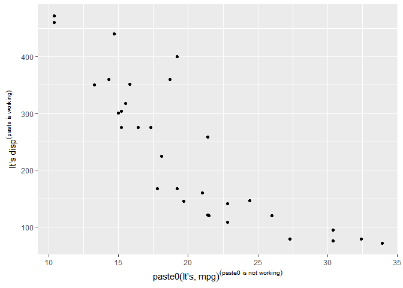
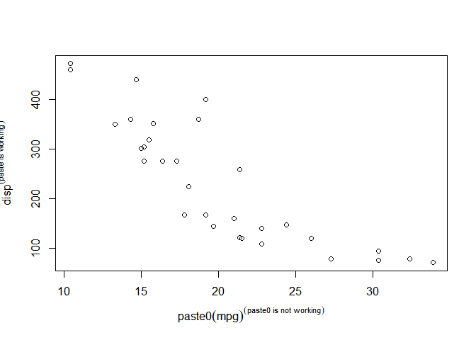
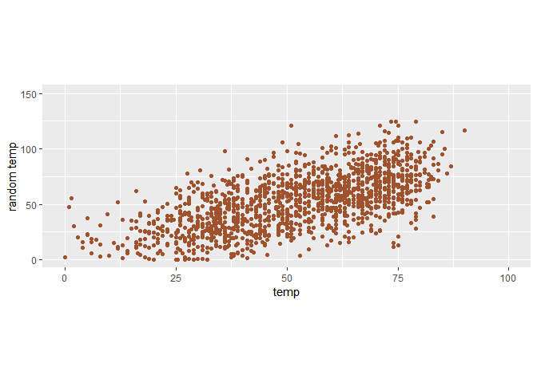

ggplot2 Notes
================

-   <a href="#setup" id="toc-setup">Setup</a>
-   <a href="#working-with-axes-titles-legends-and-themeing-etc"
    id="toc-working-with-axes-titles-legends-and-themeing-etc">Working with
    Axes, Titles, Legends and themeing etc.</a>
    -   <a href="#paste-or-paste0-doesnt-work-as-intended-inside-the-expression"
        id="toc-paste-or-paste0-doesnt-work-as-intended-inside-the-expression"><code>paste</code>
        or <code>paste0</code> doesn’t work as intended inside the
        <code>expression()</code></a>
-   <a href="#vjust-moves-text-vertically-from-the-perspective-of-the-axes"
    id="toc-vjust-moves-text-vertically-from-the-perspective-of-the-axes"><code>vjust</code>
    moves text vertically from the perspective of the Axes</a>
-   <a href="#changes-in-margint-r-b-l-are-from-our-perspective"
    id="toc-changes-in-margint-r-b-l-are-from-our-perspective">Changes in
    <code>margin(t, r, b, l)</code> are from our perspective.</a>
-   <a href="#coord_cartesianylim--c0-50and-ylimc0-50-are-not-the-same"
    id="toc-coord_cartesianylim--c0-50and-ylimc0-50-are-not-the-same"><code>coord_cartesian(ylim = c(0, 50))</code>and
    <code>ylim(c(0, 50))</code> are not the same</a>
-   <a href="#forcing-a-plot-to-start-at-origin"
    id="toc-forcing-a-plot-to-start-at-origin">Forcing a plot to start at
    origin</a>
-   <a href="#coordinates-with-ratio"
    id="toc-coordinates-with-ratio">Coordinates with <code>ratio</code></a>
-   <a href="#using-function-to-alter-labels"
    id="toc-using-function-to-alter-labels">Using function to alter
    labels</a>
-   <a href="#reminder-about-vjust-and-hjust"
    id="toc-reminder-about-vjust-and-hjust">Reminder about
    <code>vjust</code> and <code>hjust</code></a>
-   <a href="#fonts-with-r" id="toc-fonts-with-r">Fonts with R</a>
    -   <a href="#working-with-showtext" id="toc-working-with-showtext">working
        with <code>showtext</code></a>

## Setup

``` r
library(ggplot2)

chic <- readr::read_csv("https://raw.githubusercontent.com/z3tt/ggplot-courses/main/data/chicago-nmmaps-custom.csv")
```

``` r
knitr::kable(head(chic))  
```

| city | date       | temp |        o3 | dewpoint |      pm10 | season | yday | month | month_numeric | year |
|:-----|:-----------|-----:|----------:|---------:|----------:|:-------|-----:|:------|--------------:|-----:|
| chic | 1997-01-01 | 36.0 |  5.659256 |    37.50 | 13.052268 | Winter |    1 | Jan   |             1 | 1997 |
| chic | 1997-01-02 | 45.0 |  5.525417 |    47.25 | 41.948600 | Winter |    2 | Jan   |             1 | 1997 |
| chic | 1997-01-03 | 40.0 |  6.288548 |    38.00 | 27.041751 | Winter |    3 | Jan   |             1 | 1997 |
| chic | 1997-01-04 | 51.5 |  7.537758 |    45.50 | 25.072573 | Winter |    4 | Jan   |             1 | 1997 |
| chic | 1997-01-05 | 27.0 | 20.760798 |    11.25 | 15.343121 | Winter |    5 | Jan   |             1 | 1997 |
| chic | 1997-01-06 | 17.0 | 14.940874 |     5.75 |  9.364655 | Winter |    6 | Jan   |             1 | 1997 |

## Working with Axes, Titles, Legends and themeing etc.

### `paste` or `paste0` doesn’t work as intended inside the `expression()`

`paste0` doesn’t inside the `expression`. But `paste` works (sort of)
and we have to give extra space inside the `paste` to separate the
words. This happens both for `ggplot2` and `base-plot`. Asked a question
about this behaviour in
[SO](https://stackoverflow.com/questions/73045568/why-paste0-is-not-working-properly-inside-expression-in-either-ggplot2-or-ba).

``` r
g <- ggplot(chic, aes(date, temp))

g + geom_point(color = "firebrick") +
  labs(x = "Year", y = expression( paste("Temperature (", degree ~ F, ")")))
```

<!-- -->

##### For ggplot2

``` r
library(ggplot2)

ggplot(mtcars, aes(mpg, disp)) +
  geom_point() +
  labs(
    x = expression(paste0("It's","mpg")^("paste0 is not working")),
    y = expression(paste("It's ", "disp")^("paste is working")),
  )
```

<!-- -->

##### For base-plot

``` r
plot(mtcars$disp ~ mtcars$mpg, 
     xlab = expression(paste0("mpg")^("paste0 is not working")),
     ylab = expression(paste("disp")^("paste is working"))
     )
```

<!-- -->

So the reason for happening such, because inside `expression` only some
defined syntax are allowed, which we can find at the help page of
`plotmath` (using `?plotmath`)

## `vjust` moves text vertically from the perspective of the Axes

which means when you use `vjust` in `axis.title.y = element_text()`, to
move the y-axis title, it will move horizontally (from Our perspective),
but this horizontal movement is vertical from the perspective of y-axis.

``` r
ggplot(chic, aes(x = date, y = temp)) +
  geom_point(color = "firebrick") +
  labs(x = "Year", y = "Temperature (°F)") +
  theme(axis.title.x = element_text(vjust = 0, size = 15),
        axis.title.y = element_text(vjust = 2, size = 15))
```

<!-- -->

## Changes in `margin(t, r, b, l)` are from our perspective.

That is, if we want to change the distance between y-axis title and
y-axis, we need to increase the **right-margin** of `axis.title.y`, not
the bottom the margin (unlike how `vjust` works)

``` r
ggplot(chic, aes(x = date, y = temp)) +
  geom_point(color = "firebrick") +
  labs(x = "Year", y = "Temperature (°F)") +
  theme(axis.title.x = element_text(margin = margin(t = 10), size = 15),
        axis.title.y = element_text(margin = margin(r = 10), size = 15))
```

<!-- -->

## `coord_cartesian(ylim = c(0, 50))`and `ylim(c(0, 50))` are not the same

`ylim(c, 50)` (similarly `scale_y_continous(limits = c(0, 50)`) simply
filters or subset the given data based on the y value being in the
range(0, 50) and does plotting based on this filtered data.

While `coord_cartesian(ylim = c(0, 50))` plots based on the whole
dataset but then zoom into such a way that y-axis be from 0 to 50.

To get this distinction,

#### `scale_y_continuous(limits = c(0, 50))`or `ylim(c(0, 50))`

``` r
ggplot(chic, aes(factor(year), temp, group = year)) +
  geom_boxplot() +
  ylim(c(0, 50))
```

    ## Warning: Removed 777 rows containing non-finite values (stat_boxplot).

<!-- -->

#### `coord_cartesian(ylim = c(0, 50))`

``` r
ggplot(chic, aes(factor(year), temp, group = year)) +
  geom_boxplot() +
  coord_cartesian(ylim = c(0, 50))
```

<!-- -->

## Forcing a plot to start at origin

``` r
chic_high <- dplyr::filter(chic, temp > 25, o3 > 20)

p <- ggplot(chic_high, aes(temp, o3)) + 
  geom_point(color = "darkcyan")

p
```

<!-- -->

we need to use `expand_limits(x = 0, y = 0)` or
`coord_cartesian(xlim = c(0, NA), ylim = c(0, NA))` to force plot start
from `(0, 0)`

``` r
p + expand_limits(x = 0, y = 0)
```

<!-- -->

But if we look very carefully, we will see that there’s some offset at
left side of y axis at zero and at bottom side of x axis at zero. To
force the plot starting exactly from zero, we can specify
`expand = FALSE`, `clip = "off"` in `coord_*` function family.

``` r
p + expand_limits(x = 0, y = 0) + 
  coord_cartesian(expand = FALSE)
```

<!-- -->

from the help of `coord_cartesian`

> expand If TRUE, the default, adds a small expansion factor to the
> limits to ensure that data and axes don’t overlap. If FALSE, limits
> are taken exactly from the data or xlim/ylim

> clip = “off” allows drawing of data points anywhere on the plot,
> including in the plot margins. If limits are set via xlim and ylim and
> some data points fall outside those limits, then those data points may
> show up in places such as the axes, the legend, the plot title, or the
> plot margins.

So a useful use-case of `clip = "off"` is that, we can use it to draw
outside the plot panel. An example from
[`this twitter thread by Claus Wilke`](https://twitter.com/clauswilke/status/991542952802619392?lang=en)

``` r
mt_named <- data.frame(mtcars, name = row.names(mtcars))

p <- ggplot(mt_named, aes(mpg, reorder(name, mpg))) +
  geom_point(size = 2.5, color = "darkcyan") +
  geom_text(aes(x = mpg + 0.5, label = name), hjust = 0, size = 3) +
  scale_x_continuous(limits = c(10, 35)) +
  theme_bw() +
  theme(
    panel.border = element_blank(),
    panel.grid.major = element_blank(),
    axis.line.x = element_line(),
    plot.margin = margin(6, 45, 6, 6) # trouble
  )

p
```

<!-- -->

**A side Note**

-   `expand = c(0, 1)` in `scale_y_discrete` creates a padding around
    the y-axis.

> expand =\> For position scales, a vector of range expansion constants
> used to add some padding around the data to ensure that they are
> placed some distance away from the axes. Use the convenience function
> expansion() to generate the values for the expand argument. The
> defaults are to expand the scale by 5% on each side for continuous
> variables, and by 0.6 units on each side for discrete variables.

``` r
p + scale_y_discrete(name = NULL, breaks = NULL, expand = c(0, 5))
```

<!-- -->

Any way back to our topic of `clip`

``` r
p + 
  scale_y_discrete(name = NULL, breaks = NULL, expand = c(0, 1)) 
```

<!-- -->

We see that, top-left label Toyota Corolla is not showing, i.e. got cut
by the plot panel, to allow that label to show,

``` r
p + 
  scale_y_discrete(name = NULL, breaks = NULL, expand = c(0, 1)) +
  coord_cartesian(clip = "off") 
```

<!-- -->

## Coordinates with `ratio`

``` r
p <- ggplot(chic, aes(x = temp, y = temp + rnorm(nrow(chic), sd = 20))) +
  geom_point(color = "sienna") +
  labs(y = "random temp") +
  xlim(c(0, 100)) + ylim(c(0, 150))

p
```

    ## Warning: Removed 52 rows containing missing values (geom_point).

<!-- -->

Here we see that, per unit length of x axis is not same as that of y
axis. NBut we can make it same by using `coord_fixed()` which is uses
`ratio = 1` as the default value.

> coord_fixed =\> A fixed scale coordinate system forces a specified
> ratio between the physical representation of data units on the axes.
> The ratio represents the number of units on the y-axis equivalent to
> one unit on the x-axis. The default, ratio = 1, ensures that one unit
> on the x-axis is the same length as one unit on the y-axis. Ratios
> higher than one make units on the y axis longer than units on the
> x-axis, and vice versa.

``` r
p + coord_fixed()
```

    ## Warning: Removed 44 rows containing missing values (geom_point).

<!-- -->

``` r
p + coord_fixed(ratio = 1.5)
```

    ## Warning: Removed 48 rows containing missing values (geom_point).

<!-- -->

``` r
p + coord_fixed(ratio = 1/4)
```

    ## Warning: Removed 58 rows containing missing values (geom_point).

<!-- -->

## Using function to alter labels

``` r
p <- ggplot(chic, aes(x = date, y = temp)) +
  geom_point(color = "firebrick") +
  labs(x = "Year", y = NULL)

p + scale_y_continuous(label = \(x) paste(x, "Degrees Farenheit"))
```

<!-- -->

Also we can pass the `{rlang}` lambda function notation.

``` r
p + scale_y_continuous(label = ~ paste(.x, "Degrees Farenheit"))
```

<!-- -->

## Reminder about `vjust` and `hjust`

**Remember again**

-   `hjust` means horizontal adjustment and 0 for left align and 1 for
    right align
-   `vjust` means vertical adjustment and 0 for top aligned and 1 for
    bottom aligned.

``` r
p_demo <- function(vjust) {
  p + ylab("Temp") +
  ggtitle("Temperature of the area") + 
  labs(
    tag = paste("vjust", vjust)
  ) +
  theme(
    plot.margin = margin(40, 40, 40, 40),
    plot.title = element_text(vjust = vjust, hjust = 0.5, angle = 10),
    axis.title.x = element_text(vjust = vjust, hjust = 0.5, angle = 10)
  )
}

library(patchwork)

p_demo(-2) + p_demo(-1)
```

<!-- -->

``` r
p_demo(0) + p_demo(1)
```

<!-- -->

``` r
p_demo(2) + p_demo(3)
```

<!-- -->

## Fonts with R

**TODO** Have to go through [this amazing blog post for using system
fonts with
R](https://yjunechoe.github.io/posts/2021-06-24-setting-up-and-debugging-custom-fonts/),
which shows a better approach instead of using `{showtext}`

### working with `showtext`

``` r
library(showtext)
```

    ## Loading required package: sysfonts

    ## Loading required package: showtextdb

``` r
font_add_google("Playfair Display", ## name of google font
                "playfair") ## name that will be used in R

font_add_google("Bangers", "bangers")

showtext_auto()
ggplot(chic, aes(date, temp)) +
  geom_point(color = "firebrick") +
  labs(x = "Year", y = "Temperature", 
       title = "Daily Temperature in Farenheit",
       subtitle = "From 1997 to 2001") +
  theme(
    plot.title = element_text(family = "bangers", size = 25, hjust = 0.5),
    plot.subtitle = element_text(family = "playfair", size = 15, hjust = 0.5)
  )
```

<!-- -->

And to implement fonts all over the plot that is, for all text element
of the plot, we need to set the `base_family` equal to the google font

``` r
font_add_google("Roboto Condensed", "rob con")

showtext_auto()
ggplot(chic, aes(date, temp)) +
  geom_point(color = "firebrick") +
  labs(x = "Year", y = "Temperature", 
       title = "Daily Temperature in Farenheit",
       subtitle = "From 1997 to 2001") +
  theme_bw(base_size = 12, base_family = "rob con")
```

<!-- -->
