stat summary of Ggplot2
================

-   <a href="#demystifying-stat_-layers-in-ggplot2"
    id="toc-demystifying-stat_-layers-in-ggplot2">Demystifying stat_ layers
    in {ggplot2}</a>
    -   <a href="#some-usecases-of-stat_summary"
        id="toc-some-usecases-of-stat_summary">Some Usecases of stat_summary</a>
-   <a href="#summary-statistic-in-ggplot2-tutorial-from-ggplot2tor"
    id="toc-summary-statistic-in-ggplot2-tutorial-from-ggplot2tor">Summary
    Statistic in Ggplot2 (tutorial from GGplot2tor)</a>

> **DISCLAIMER:** This note is based on (mostly copy pasted from) these
> sources \[1\]
> [demystifying-stat-layers-ggplot2](https://yjunechoe.github.io/posts/2020-09-26-demystifying-stat-layers-ggplot2/)
> \[2\] [Summary statistics from
> ggplot2tor](https://ggplot2tor.com/tutorials/summary_statistics)

## Demystifying stat\_ layers in {ggplot2}

`stat_summary` works in the following order:

1.  The data that is passed into `ggplot()` is inherited to
    `stat_summary` if one is not provided

2.  The function passed into the `fun.data` argument applies
    transformations to a part of data (that was inherited/provided).
    `fun.data` defaults to `mean_se` function.

3.  The result is then passed into `geom` provided in the `geom`
    argument of the `stat_summary` (`geom` defaults to `pointrange` if
    not specified).

4.  If the transformed data contains all the required mappings for the
    geom, then geom will be printed.

-   **`stat_summary` summarizes one dimension of the data.**

``` r
library(dplyr)
library(ggplot2)
library(tibble)
```

``` r
height_df <- tibble(group = "A",
                    height = rnorm(30, 170, 10))

height_df %>% 
  ggplot(aes(x = group, y = height)) +
  stat_summary()
```

    ## No summary function supplied, defaulting to `mean_se()`

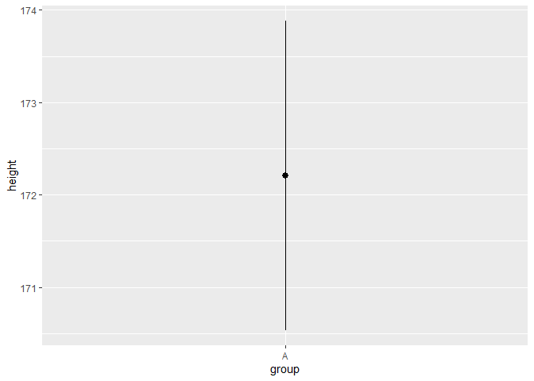<!-- -->

So as the points mentioned above, `geom = pointrange` and
`fun.data = mean_se` are used here.

To verify this, we can actually look into the transformed data by
`mean_se` and by `stat_summary`.

The `mean_se` function internally looks like,

``` r
mean_se
```

    ## function (x, mult = 1) 
    ## {
    ##     x <- stats::na.omit(x)
    ##     se <- mult * sqrt(stats::var(x)/length(x))
    ##     mean <- mean(x)
    ##     new_data_frame(list(y = mean, ymin = mean - se, ymax = mean + 
    ##         se), n = 1)
    ## }
    ## <bytecode: 0x000001a9b70a8a40>
    ## <environment: namespace:ggplot2>

``` r
mean_se(height_df$height)
```

    ##          y     ymin     ymax
    ## 1 172.2093 170.5377 173.8808

``` r
point_range_plot <- height_df %>% 
  ggplot(aes(group, height)) + 
  stat_summary()

layer_data(point_range_plot, 1) # here 1 means 1st layer which is pointrange here,
```

    ## No summary function supplied, defaulting to `mean_se()`

    ##   x group        y     ymin     ymax PANEL flipped_aes colour size linetype
    ## 1 1     1 172.2093 170.5377 173.8808     1       FALSE  black  0.5        1
    ##   shape fill alpha stroke
    ## 1    19   NA    NA      1

``` r
# but since here only one geom is used, so if we omit 1, consequence will be same.
```

which is similar as above, so it is proved that `stat_summary` using
`mean_se` as default.

### Some Usecases of stat_summary

#### Error bar showing 95% confidence Interval

``` r
data(penguins, package = "palmerpenguins")

peng <- na.omit(penguins)
```

``` r
peng %>% 
  ggplot(aes(sex, body_mass_g)) +
  stat_summary(
    fun.data = ~mean_se(.x, mult = 1.96),
    geom = "errorbar"
  )
```

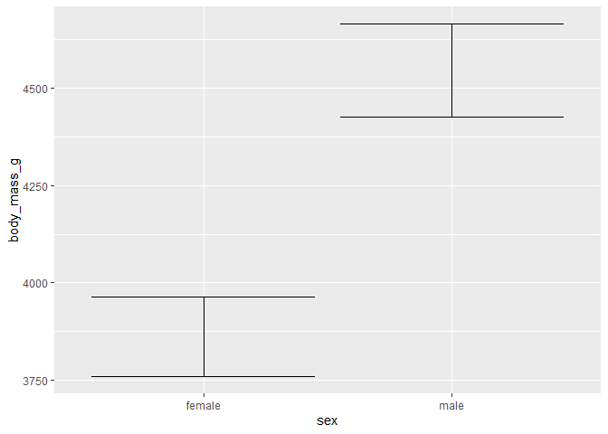<!-- -->

#### A color coded bar plot of median

Here we want to color a bar if median for a specific bar is less than a
threshold (say 40).

``` r
# custom function for fun.data

calc_median_and_color <- function(x, threshold = 40) {
  tibble(y = median(x)) %>% 
    mutate(
      fill = if_else(y < threshold, "pink",  "gray35")
    )
}

peng %>% 
  ggplot(aes(species, bill_length_mm)) +
  stat_summary(
    fun.data = calc_median_and_color,
    geom = "bar"
  )
```

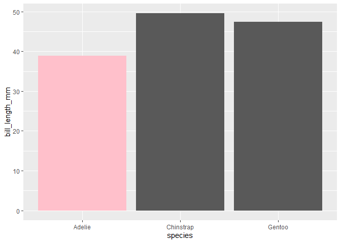<!-- -->

Here we have deliberately used the colname `fill` so that it can be used
as an argument of geom.

#### pointrange plot with changing size

``` r
peng %>% 
  ggplot(aes(species, bill_length_mm)) +
  stat_summary(
    fun.data = \(x) {
      scaled_size <- length(x) / nrow(peng)
      mean_se(x) %>% mutate(size = scaled_size)
    }
  )
```

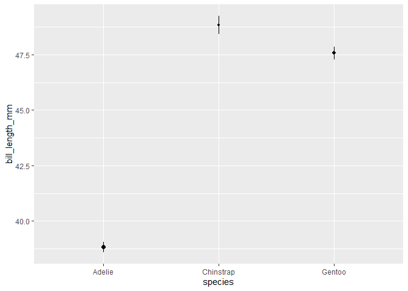<!-- -->

## Summary Statistic in Ggplot2 (tutorial from GGplot2tor)

``` r
library(tidyverse)
library(gapminder)

head(gapminder)
```

    ## # A tibble: 6 × 6
    ##   country     continent  year lifeExp      pop gdpPercap
    ##   <fct>       <fct>     <int>   <dbl>    <int>     <dbl>
    ## 1 Afghanistan Asia       1952    28.8  8425333      779.
    ## 2 Afghanistan Asia       1957    30.3  9240934      821.
    ## 3 Afghanistan Asia       1962    32.0 10267083      853.
    ## 4 Afghanistan Asia       1967    34.0 11537966      836.
    ## 5 Afghanistan Asia       1972    36.1 13079460      740.
    ## 6 Afghanistan Asia       1977    38.4 14880372      786.

``` r
gapminder %>% 
  ggplot(aes(x = year, y = lifeExp)) +
  geom_col()
```

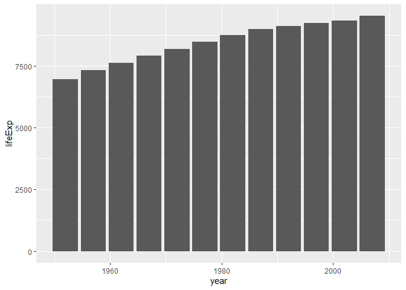<!-- -->

here bar chart does not show the mean or median of lifeExpectancy for
all countries, instead shows the sum of lifeExp for each year.

But if we want to show the mean lifeExp, we can do that.

``` r
gapminder %>% 
  ggplot(aes(x = year, y = lifeExp)) +
  geom_bar(fun = "mean", stat = "summary")
```

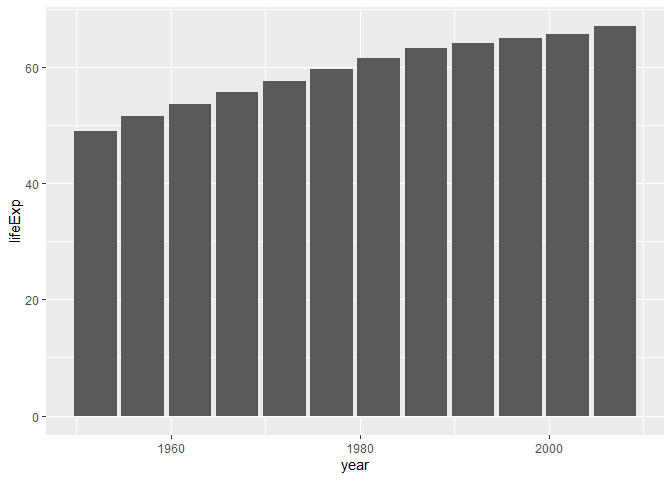<!-- -->

But in this approach, we can only draw bar plots. Heres where
`stat_summary` comes into play. With `stat_summary` we can plot summary
statistics with many different geoms.

``` r
gapminder %>% 
  ggplot(aes(year, lifeExp)) +
  stat_summary(fun = "mean", geom = "point") +
  stat_summary(fun = "mean", geom = "line")
```

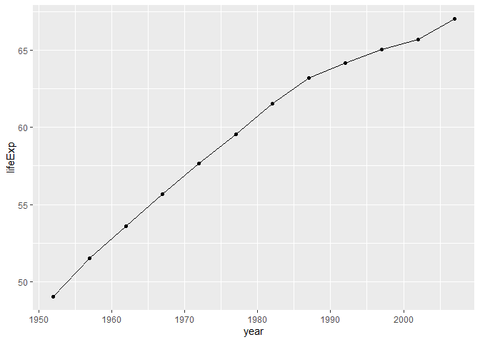<!-- -->

If we want to see median lifeExps,

``` r
gapminder %>% 
  ggplot(aes(year, lifeExp)) +
  stat_summary(fun = "median", geom = "area", fill = "dodgerblue", alpha = 0.3) +
  stat_summary(fun = median, geom = "point", color = "firebrick")
```

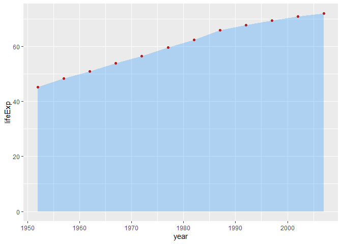<!-- -->

Now if we want to plot point estimate with maximum minimum of lifeExp,

``` r
gapminder %>% 
  ggplot(aes(year, lifeExp)) +
  stat_summary(
    fun = mean,
    fun.min = min,
    fun.max = max,
    geom = "pointrange"
  )
```

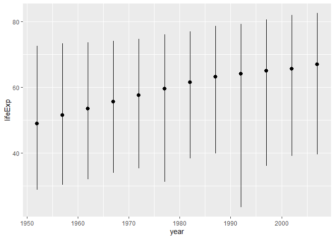<!-- -->

``` r
# or using fun.data

gapminder %>% 
  ggplot(aes(year, lifeExp)) +
  stat_summary(
    fun.data = \(x) {
      data.frame(y = mean(x), ymax = max(x), ymin = min(x))
    }
  )
```

<!-- -->

we also can show error bar,

``` r
gapminder %>% 
  ggplot(aes(year, lifeExp)) +
  stat_summary(
    geom = "errorbar",
    width = 1,
    fun.min = min,
    fun.max = max
  )
```

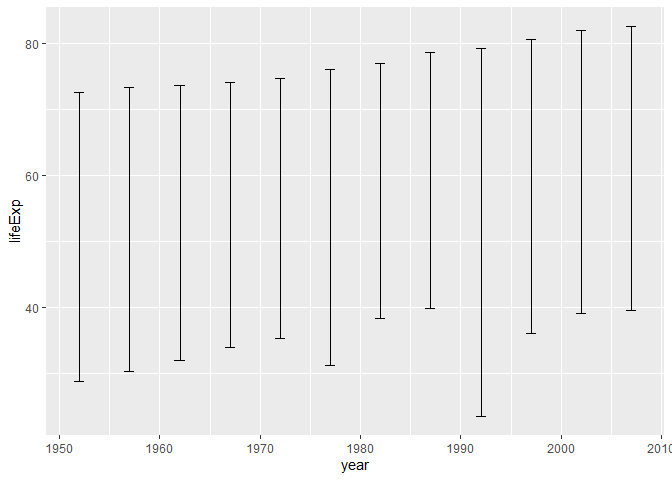<!-- -->

``` r
g <- gapminder %>% 
  ggplot(aes(year, lifeExp))

# 95% normal CI
g + stat_summary(
  fun.data = mean_cl_normal,
  geom = "errorbar",
  width = 1
) +
stat_summary(
  fun = mean,
  geom = "point"
)
```

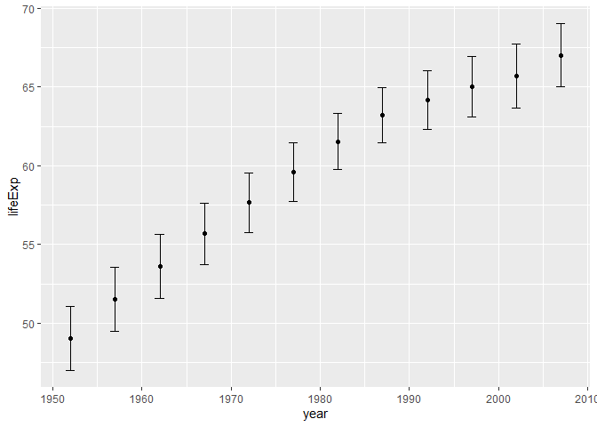<!-- -->

``` r
# 99% normal CI
g + stat_summary(
  fun.data = ~ mean_cl_normal(.x, conf.int = 0.99),
  geom = "errorbar",
  width = 1
) +
stat_summary(
  fun = mean,
  geom = "point"
)
```

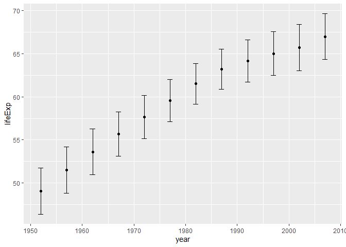<!-- -->

``` r
median_IQR <- \(x) {
  list(
    y = median(x),
    ymin = quantile(x)[2],
    ymax = quantile(x)[4]
  )
}

range <- \(x) {
  list(ymin = min(x), ymax = max(x))
}
```

``` r
g + 
  stat_summary(
    geom = "linerange",
    fun.data = median_IQR,
    size = 3,
    alpha = 0.3
  ) +
  stat_summary(
    geom = "linerange",
    fun.data = range,
    size = 3,
    alpha = 0.3
  ) +
  stat_summary(
    geom = "point",
    fun = "mean",
    shape = "X",
    size = 3
  )
```

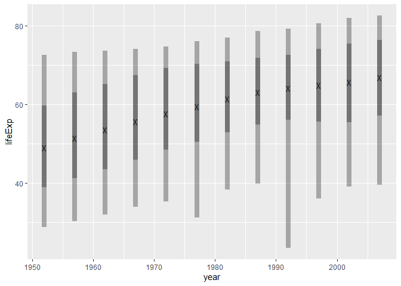<!-- -->

``` r
gapminder %>% 
  mutate(
    year = as.factor(year)
  ) %>% 
  ggplot(aes(continent, lifeExp, fill = year)) +
  stat_summary(
    geom = "bar",
    fun = "mean",
    position = position_dodge(0.95)
  ) +
  stat_summary(
    geom = "errorbar",
    fun.data = ~mean_cl_normal(.x, conf.int = 0.99),
    position = position_dodge(0.95),
    width = 0.5
  ) +
  stat_summary(
    geom = "point",
    fun = "mean",
    size = 1,
    position = position_dodge(0.95),
    show.legend = FALSE
  ) +
  scale_fill_viridis_d() +
  guides(
    fill = guide_legend(
      title = NULL,
      nrow = 2, byrow = TRUE, 
      keywidth = unit(20, "pt"),
      keyheight = unit(3, "pt")
    )
  ) +
  theme(
    legend.position = "bottom"
  )
```

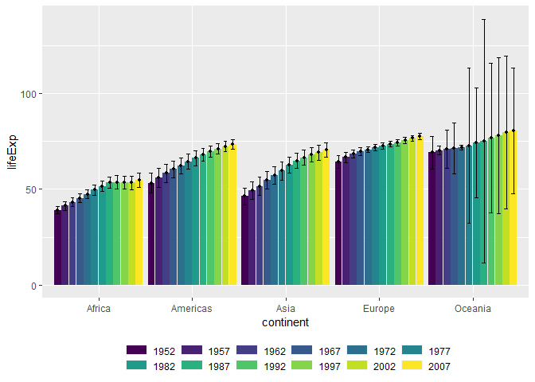<!-- -->

``` r
stat_fun <- \(x, fill = NULL, alpha = NULL, size = NULL) {
      list(
        y = mean(x), ymax = max(x), ymin = min(x),
        alpha = alpha, fill = fill, size = size
      )
}

gapminder %>% 
  ggplot(aes(year, lifeExp)) +
  stat_summary(
    geom = "ribbon",
    # fun.data = ~stat_fun(.x, fill = "firebrick", alpha = 0.3)
    fun.data = ~stat_fun(.x),
    fill = "firebrick",
    alpha = 0.3
  ) +
  stat_summary(
    geom = "pointrange",
    fun.data = ~stat_fun(.x),
    size = 0.4
  ) +
  stat_summary(
    geom = "line",
    fun = min,
    color = "firebrick"
  ) +
  stat_summary(
    geom = "line",
    fun = max,
    color = "firebrick"
  ) +
  facet_wrap(~continent)
```

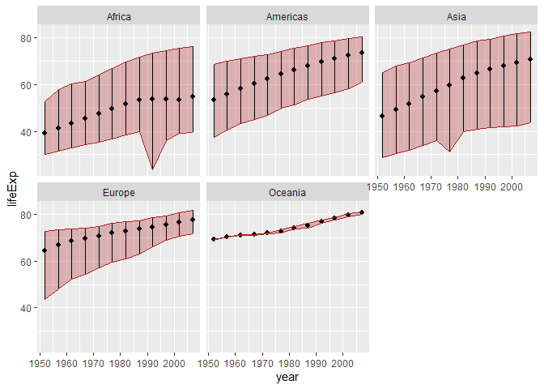<!-- -->
