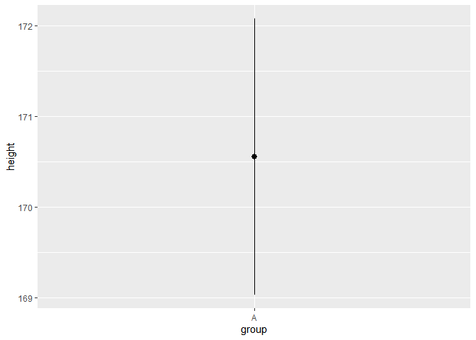

stat summary of Ggplot2
================

-   <a href="#demystifying-stat_-layers-in-ggplot2"
    id="toc-demystifying-stat_-layers-in-ggplot2">Demystifying stat_ layers
    in {ggplot2}</a>
    -   <a href="#some-usecases-of-stat_" id="toc-some-usecases-of-stat_">Some
        Usecases of stat_*</a>

> **DISCLAIMER:** This note is based on (mostly copy pasted from) these
> sources \[1\]
> [demystifying-stat-layers-ggplot2](https://yjunechoe.github.io/posts/2020-09-26-demystifying-stat-layers-ggplot2/)

## Demystifying stat\_ layers in {ggplot2}

`stat_summary` works in the following order:

1.  The data that is passed into `ggplot()` is inherited to
    `stat_summary` if one is not provided

2.  The function passed into the `fun.data` argument applies
    transformations to a part of data (that was inherited/provided).
    `fun.data` defaults to `mean_se` function.

3.  The result is then passed into `geom` provided in the `geom`
    argument of the `stat_summary` (`geom` defaults to `pointrange` if
    not specified).

4.  If the transformed data contains all the required mappings for the
    geom, then geom will be printed.

-   **`stat_summary` summarizes one dimension of the data.**

``` r
library(dplyr)
library(ggplot2)
library(tibble)
```

``` r
height_df <- tibble(group = "A",
                    height = rnorm(30, 170, 10))

height_df %>% 
  ggplot(aes(x = group, y = height)) +
  stat_summary()
```

    ## No summary function supplied, defaulting to `mean_se()`

<!-- -->

So as the points mentioned above, `geom = pointrange` and
`fun.data = mean_se` are used here.

To verify this, we can actually look into the transformed data by
`mean_se` and by `stat_summary`.

The `mean_se` function internally looks like,

``` r
mean_se
```

    ## function (x, mult = 1) 
    ## {
    ##     x <- stats::na.omit(x)
    ##     se <- mult * sqrt(stats::var(x)/length(x))
    ##     mean <- mean(x)
    ##     new_data_frame(list(y = mean, ymin = mean - se, ymax = mean + 
    ##         se), n = 1)
    ## }
    ## <bytecode: 0x0000027ad95645b0>
    ## <environment: namespace:ggplot2>

``` r
mean_se(height_df$height)
```

    ##          y     ymin     ymax
    ## 1 170.2081 168.3855 172.0307

``` r
point_range_plot <- height_df %>% 
  ggplot(aes(group, height)) + 
  stat_summary()

layer_data(point_range_plot, 1) # here 1 means 1st layer which is pointrange here,
```

    ## No summary function supplied, defaulting to `mean_se()`

    ##   x group        y     ymin     ymax PANEL flipped_aes colour size linetype
    ## 1 1     1 170.2081 168.3855 172.0307     1       FALSE  black  0.5        1
    ##   shape fill alpha stroke
    ## 1    19   NA    NA      1

``` r
# but since here only one geom is used, so if we omit 1, consequence will be same.
```

which is similar as above, so it is proved that `stat_summary` using
`mean_se` as default.

### Some Usecases of stat\_\*
